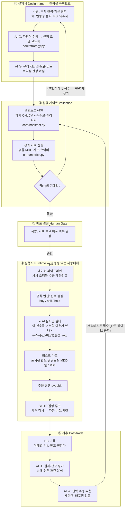

# Kerdos — ATAS (Auto Trading AI System)

> **kerdos** : 그리스어로 *이익*

인간의 투자 판단 과정을 자동화한 AI 트레이딩 시스템.  
GPT-4o가 기술적 지표·차트 이미지·뉴스·공포탐욕지수·유튜브 정보를 종합 분석해  
업비트에서 ETH/KRW를 자동 매매한다.

---

## 목표

```
데이터 수집 → AI 판단(GPT-4o) → 업비트 주문 → DB 기록 → 회고 → 반복
```

- 멀티모달 AI (텍스트 + 차트 이미지)로 사람처럼 시장을 분석
- 매매 후 자기 회고(Reflection)를 생성해 전략을 재귀적으로 개선
- Streamlit 대시보드로 매매 현황 실시간 모니터링

---

## 아키텍처

```
autotrad.py (메인 루프)
│
├── 데이터 수집
│   ├── pyupbit          — ETH OHLCV (일봉 30일, 1시간봉 24시간), 오더북
│   ├── core/indicators  — 보조지표 계산 (볼린저밴드·RSI·MACD·SMA·EMA·엔벨로프)
│   ├── core/external    — 공포탐욕지수 (alternative.me)
│   │                   — ETH 뉴스 (SerpAPI / Google News)
│   │                   — 업비트 차트 스크린샷 (Selenium + Chrome)
│   │                   — 유튜브 자막 (youtube-transcript-api)
│   └── core/db          — 최근 매매 기록 + 이전 회고 로드
│
├── AI 판단 (GPT-4o)
│   └── JSON 응답: decision / percentage / reason / confidence / stop_loss / take_profit
│
├── 매매 실행 (pyupbit)
│   ├── buy  : KRW × percentage% × 0.9995 시장가 매수 (최소 5,000 KRW)
│   ├── sell : ETH × percentage% 시장가 매도
│   └── hold : 미체결
│
├── 기록 & 회고
│   ├── core/db          — PostgreSQL eth_auto_trad 테이블에 저장
│   └── core/reflection  — GPT-4o로 직전 매매 회고 생성 → DB 업데이트
│
└── streamlit_app.py     — 실시간 대시보드 (10초 자동 새로고침)
```

---

## 기술 스택

| 구분 | 사용 기술 |
|------|----------|
| 언어 | Python 3.9.23 |
| AI 모델 | OpenAI GPT-4o (텍스트 + 비전) |
| 거래소 | 업비트 (pyupbit) |
| 보조지표 | ta (technical-analysis-library) |
| 차트 캡처 | Selenium + Chrome (headless) |
| 뉴스 수집 | SerpAPI (Google News) |
| 공포탐욕지수 | alternative.me API |
| 유튜브 | youtube-transcript-api |
| 데이터베이스 | PostgreSQL (psycopg2) |
| 대시보드 | Streamlit + streamlit-autorefresh |
| 환경변수 | python-dotenv |

---

## 서버 환경

| 항목 | 사양 |
|------|------|
| OS | Rocky Linux 9.7 (Blue Onyx) |
| Kernel | 5.14.0-611.5.1.el9_7.x86_64 |
| CPU | Intel Core i5-8400 @ 2.80GHz (6코어 / 6스레드) |
| Memory | 32GB DDR4 |
| Storage | SSD |
| Python | 3.9.23 |

---

## 프로젝트 구조

```
Kerdos/
├── autotrad.py         # 메인 자동매매 스크립트
├── mvp.py              # MVP 단순 버전 (OHLCV만 사용)
├── streamlit_app.py    # 실시간 대시보드
├── requirements.txt    # Python 의존성
├── commit.sh           # 파일별 개별 커밋 유틸리티
├── .gitignore
│
├── core/
│   ├── db.py           # PostgreSQL CRUD (테이블 초기화·저장·조회·성과계산)
│   ├── external.py     # 외부 데이터 수집 (공포탐욕·뉴스·차트캡처·유튜브)
│   ├── indicators.py   # 기술적 보조지표 계산
│   └── reflection.py   # GPT-4o 회고 생성
│
├── docs/               # 프로젝트 문서 및 로드맵
│   ├── ASTP_DEVELOPMENT_PLAN.md  # ASTP 개발 기획서
│   └── STRATEGY_ROADMAP.md       # 전략 전환 로드맵
│
├── capture/            # 차트 스크린샷 저장 디렉터리
├── retrospect/         # 회고 관련 실험 파일
└── test/               # 테스트 코드
```

---

## DB 스키마

```sql
CREATE TABLE eth_auto_trad (
    id                SERIAL PRIMARY KEY,
    time              TIMESTAMP NOT NULL,    -- 기록 시각
    decision          VARCHAR(10),           -- buy / sell / hold
    percentage        NUMERIC,               -- 매매 비중 (%)
    reason            TEXT,                  -- AI 매매 사유
    eth_balance       NUMERIC,               -- 매매 후 ETH 잔고
    krw_balance       NUMERIC,               -- 매매 후 KRW 잔고
    eth_avg_buy_price NUMERIC,               -- ETH 평균 매수단가
    eth_krw_price     NUMERIC,               -- ETH 현재가
    reflection        TEXT                   -- AI 자기 회고
);
```

---

## 환경변수 (.env)

```env
# OpenAI
OPENAI_API_KEY=sk-...

# 업비트 API
UPBIT_ACCESS_KEY=...
UPBIT_SECRET_KEY=...

# SerpAPI (뉴스 수집)
SERPAPI_KEY=...

# 유튜브 영상 ID (기본: 워뇨띠 채널)
YOUTUBE_VIDEO_ID=3XbtEX3jUv4

# PostgreSQL
PG_DBNAME=...
PG_USER=...
PG_PASSWORD=...
PG_HOST=localhost
PG_PORT=5432
```

---

## 의존성

```
python-dotenv
openai
pyupbit
ta
selenium
webdriver-manager
Pillow
youtube-transcript-api
psycopg2-binary
streamlit
plotly
streamlit-autorefresh
```

---

## feat/v2-astp: ASTP 전환 로드맵

현재의 "재량적 AI 어드바이저"를 검증 가능한 "전략 트레이딩 시스템"으로 전환합니다.

| Phase | 목표 | 주요 내용 |
|-------|------|----------|
| **1. 검증 토대** | 백테스트 & 메트릭 | 백테스트 엔진(`core/backtest.py`), 성과 지표 모듈 구축 |
| **2. 규칙 코드화** | 전략 & 실행 | 진입/청산 규칙 명문화, SL/TP 실시간 집행 루프 구현 |
| **3. 리스크 통제** | 자산 보호 | 포지션 사이징 공식, 일일 손실 한도, MDD 킬스위치 |
| **4. AI 역할 고도화** | 에이전트 전환 | GPT를 '결정자'에서 '검증된 규칙 위의 필터/평가자'로 전환 |

> 상세 계획은 `docs/ASTP_DEVELOPMENT_PLAN.md` 및 `docs/STRATEGY_ROADMAP.md` 참조

---

## 전체 작업 흐름 (ASTP Workflow)

> 이 시스템의 핵심 원칙: **AI는 전략을 만들거나 튜닝하는 "결정자"가 아니라,
> 규칙을 초안 잡고(설계) → 신호를 거르고(실행) → 결과를 평가하고(사후) →
> 개선을 *제안만* 하는(사후) "보조자"다. 검증·결정은 항상 백테스트와 사람이 한다.**



### AI의 4가지 역할과 안전 경계

| 시점 | AI 역할 | 하는 것 | 절대 안 하는 것 |
|------|---------|---------|----------------|
| 설계시 ① | 규칙 초안 | 자연어 전략을 `Strategy` 코드로 변환 | 백테스트 점수 보고 **파라미터 최적화** (과최적화) |
| 설계시 ② | 규칙 검토 | 논리 정합성·모순 점검 | **수익성 판정** (그건 백테스트의 일) |
| 실행시 ★ | 실시간 필터 | 규칙 신호에 대한 **거부권(veto)** | 신호 **생성·결정** (그건 규칙 엔진의 일) |
| 사후 ③ | 결과 평가 | 체결 결과·잔고 귀인 분석 | — |
| 사후 ④ | 수정 추천 | 개선안 **제안** | 추천안 **자동 배포** (재백테스트 필수) |

### 핵심 가드레일

1. **결정성 우선** — 같은 시장 입력 → 항상 같은 신호. 매매를 움직이는 건 백테스트 *값*이 아니라 코드로 고정된 *규칙*이다.
2. **과최적화 차단** — AI가 과거 데이터에 맞춰 파라미터를 "세팅"하게 두지 않는다. 설정값은 전략 논리 + 워크포워드 검증에서 나온다.
3. **검증 게이트** — 백테스트로 양(+)의 기대값을 증명하지 못한 전략은 라이브에 올리지 않는다.
4. **사람의 배포권** — 배포 결정과 전략 수정 승인은 항상 사람이 한다. AI는 제안까지만.
5. **수정 루프 봉인** — `AI 추천 → 재백테스트 → 사람 승인 → 배포`. `AI 추천 → 바로 라이브`는 금지 (최근 노이즈 과최적화 방지).
